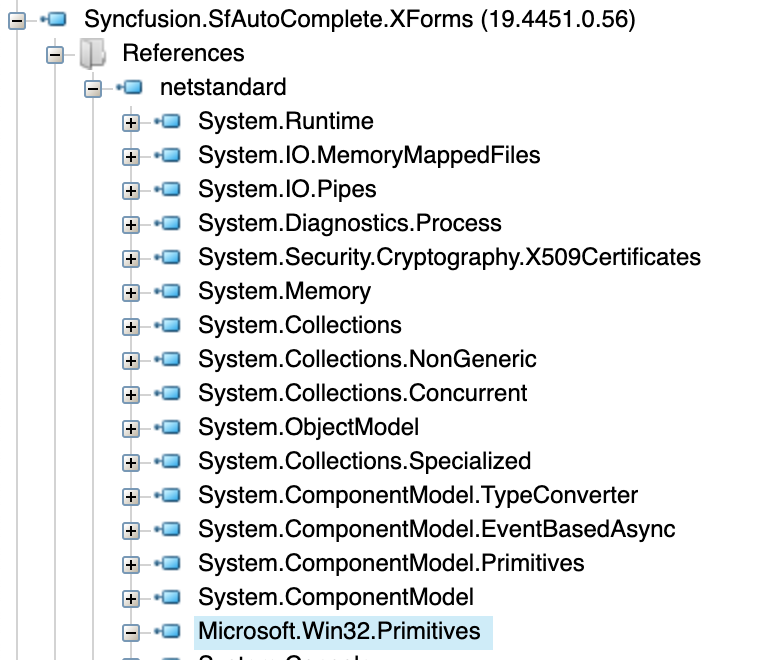
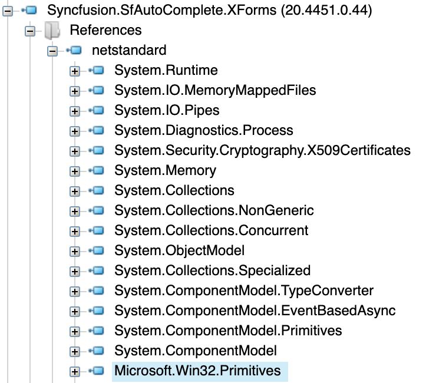
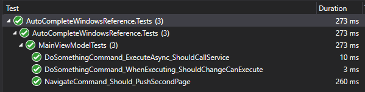
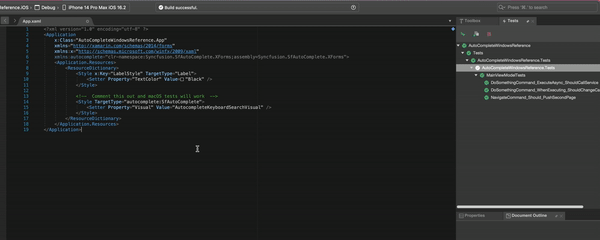

# SfAutoComplete Win32 Reference
Reproduction app to demonstrate a rogue Win32 reference in SfAutoComplete control that affects unit test execution on Visual Studio For Mac (any version).

## Issue

I found on a project that unit tests would run on windows but on mac they would fail whenever calling `MockForms.Init()`. The following exception would be thrown:

```
System.TypeLoadException : Could not load type 'System.Windows.Freezable' from assembly 'WindowsBase, Version=4.0.0.0, Culture=neutral, PublicKeyToken=31bf3856ad364e35'.
```

This would happen during `InitializeComponent()` of the app class when creating a unit test instance of the `Xamarin.Forms.Application` class used for the forms app. It also happens when setting the `Visual` property in the xaml of a `ContentPage`.

I've traced the issue back to an assembly reference to `Microsoft.Win32.Primitives` in the SfAutoComplete nuget package. It is present in 19.4 (which I regularly use at work) and also 20.4 (latest version):

#### 19.4 Win32 Ref



#### 20.4 Win32 Ref




## Reproduction

I have provided a comprehensive reproduction of this issue in this repo. To run it perform the following steps:

### Windows (Working)

- Pull the sample code on windows
- Open project in visual studio
- Build the solution
- Run unit tests
- Tests pass



### macOS (Failing)

- Pull the sample code on macOS
- Open project in visual studio for mac
- Build the solution
- Run unit tests
- Tests fail
- Comment out sf autocomplete stylings in App.Xaml
- Rerun tests
- Tests pass


